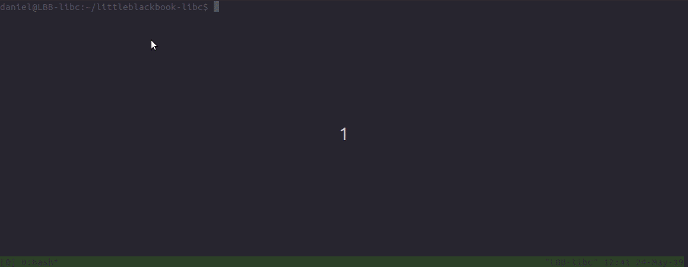
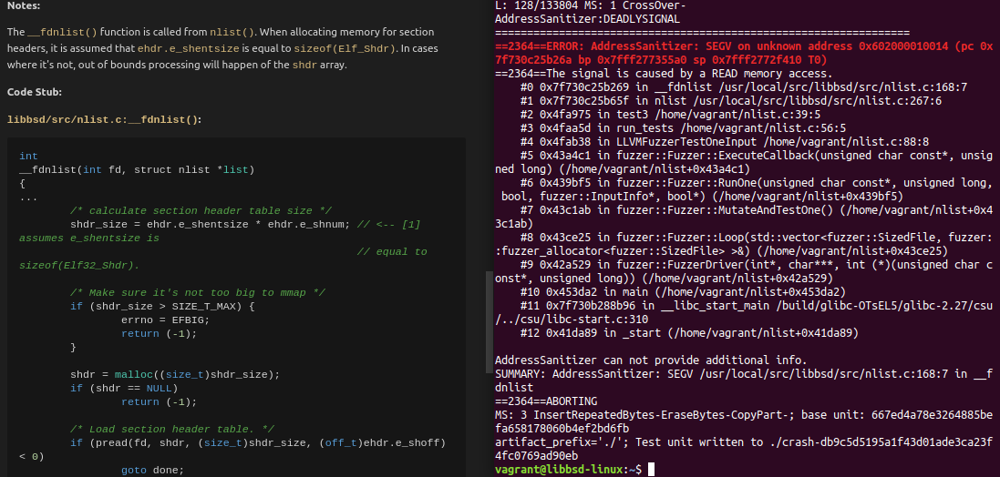

# littleblackbook-libc

## What does this project do?

The "Little Black Book of libC" (LBB-libc) is a project to assist in configuring machines
so they are ready to test and debug a variety of libc implementations. 
Specifically:

* The project uses host build and configuration management tools to create target
combinations of libc×compiler×platform×architecture.
Please read the [overview](docs/OVERVIEW.md) to understand how.

* The project provides a set of useful libc unit tests.

* The project documents both manual code review and automated testing results.

## Why is this project useful?

Imagine you want to test the security of your code across a combination of 2 libc's,
2 compilers, 2 platforms, and 1 architecture.
That would require configuring and installing 8 unique builds.
Now imagine you want to target 2 architectures.
That would require 16 unique builds.
This is obviously a problem which needs automation.

Hopefully using LBB-libc helps reduce setup time, allowing you to focus on testing *how* a
libc works.

The provided unit tests log all input/output for offline analysis.
This may be useful in a number of ways:

* Correlating input/output across libc's to identify discrepencies
* Correlating input/output across platforms/compilers/architectures to identify defects
* Instrumenting tests with AFL or LibFuzzer to identify security issues.

The author uses this project to complement manual code reviews, with the goal of
identifying insecure function use and primitives that assist in exploit dev.

The project is most likely to be of interest to security code reviewers, libc developers,
and test engineers.

## Project Status

**99% not ready to use :)**. Though it can do the following:

* Install Vagrant/Ansible, and git clone libc repos for auditing.
* Create and Configure guest virtual machines using Vagrant.
* Provision libc, compiler, and fuzzer tooling across guest virtual machines.
* Implements a handful of unit tests.

As it's a hobby project, features are being added when time and energy permit.
If you're interested in helping please read [CONTRIBUTING.md](docs/CONTRIBUTING.md).

## How do I get started?

I'm glad you're interested, please read [INSTALL.md](docs/INSTALL.md) for instructions on
installing LBB-libc and getting started.

## Where can I get more help, if I need it?

Please create a github issue.