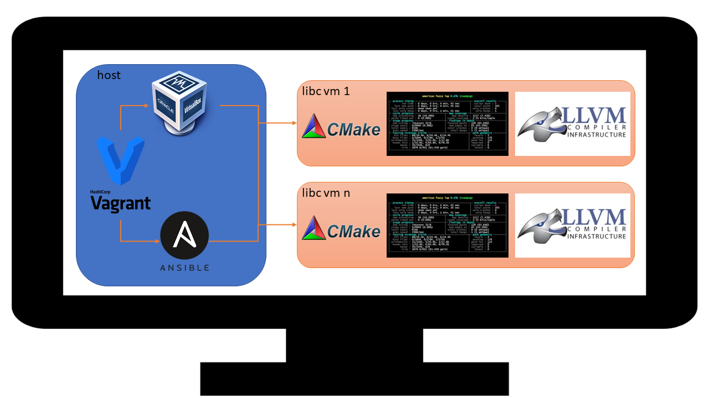

# General Overview



The above picture shows a conceptual overview of how the project currently looks.
A host is a system which runs the LBB-libc project.
A target is a machine which will be provisioned with libc and tooling.
It is possible to use a virtual machine or bare metal as the target.

A design goal of LBB-libc is to limit host and target dependencies to ansible.
It is therefore possible to use LBB-libc in a configuration which best matches your needs.

**Important:** Even though the end goal is to support combinations, we currently only
support Linux ("Ubuntu") guests.
This is easy to fix, but for now it's the only platform supported while we get the
project skeleton worked out.

# Host Overview

## Ansible

Ansible is used to provision software onto targets, and is essentially the brains
of the operation.
The various playbooks and roles will configure libc, compiler, and fuzz related tooling.

## Virtualbox

Oracle's Virtualbox is currently used as the hypervisor for guest virtual machines.
This isolates tests from the host environment and should limit the impact of any
destructive operations that arise from testing.

_NB: This is optional, you can use bare metal for your targets if desired._

## Vagrant

Hashicorp's Vagrant is used to manage target VM lifecycle and provisioning, abstracting
away hypervisor specific details.
This makes it simple to swap Virtualbox with QEMU etc.

The target image is based on Vagrant Cloud "boxes", and if needed you can roll your own.

_NB: This is optional, you can manage your targets manually if desired._

# Targets Overview

## Ansible

Targets will need to have SSH/Python installed so that ansible can provision software
needed for build management, compiling/linking, and testing.

## Currently Supported

The following combinations of compiler, platform, and architecture are currently supported
for a target:

```
daniel@LBB-libc:~/littleblackbook-libc$ ./scripts/infra_supported.py 
('gcc 7.4.0', 'Linux 4.15.0', 'x86_64')
('clang 9.0', 'Linux 4.15.0', 'x86_64')
daniel@LBB-libc:~/littleblackbook-libc$ 
```

# Tests Overview

Tests are nothing more than a basic C program which is linked against a target libc and
will return either success (0) or failure (!0).

Various unit test frameworks were considered, however most had dependencies that caused
problems when linking against multiple libc's.
In addition, we have some design goals that include fuzzing and using external tools to
verify correctness - which further limit our options with test frameworks.
By creating our own, we have better control over how this process will work.

## Unit Tests

The basic idea of the unit test is to provide a main program which exercises all aspects
of a given libc function.
It should log to the console all input/output generated during the test, and return an
error code which indicates a bit array of succcess (0) and failure (1) tests.

Kitware's CMake is used for building unit tests on any given target.

## LibFuzzer

In cases where a given function lends itself to fuzz testing, a wrapper is provided that
can be linked against libfuzzer.
This wrapper will still call all of the functions of the unit test but will not perform
logging.

## AFL

In cases where a given function lends itself to fuzz testing, a wrapper is provided that
can be linked against AFL.
This wrapper will still call all of the functions of the unit test but will not perform
logging.